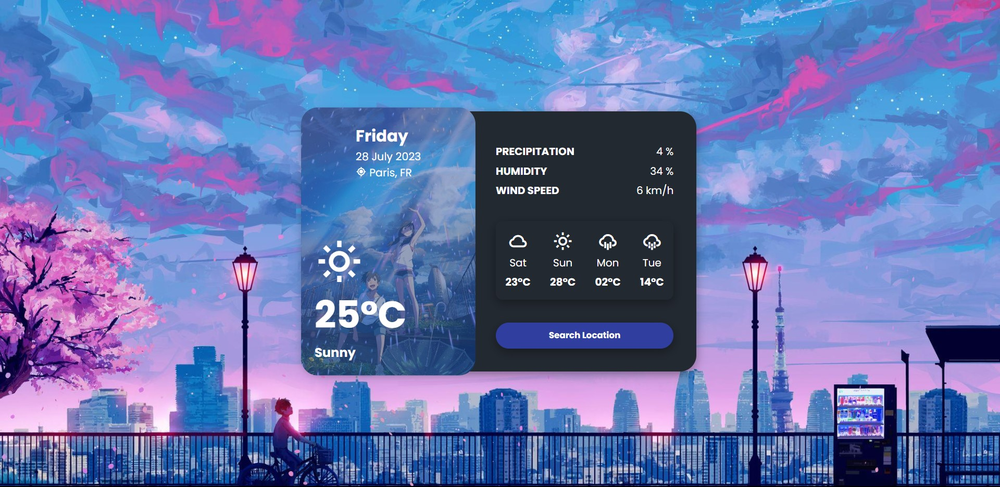

# Info
You need to get your own api key and replace it in index.js file :

```javascript
const apiKey = 'YOUR_API_KEY';
You can use https://openweathermap.org/api
```

# Screenshot
Here we have project screenshot :



IG = krupal.xo